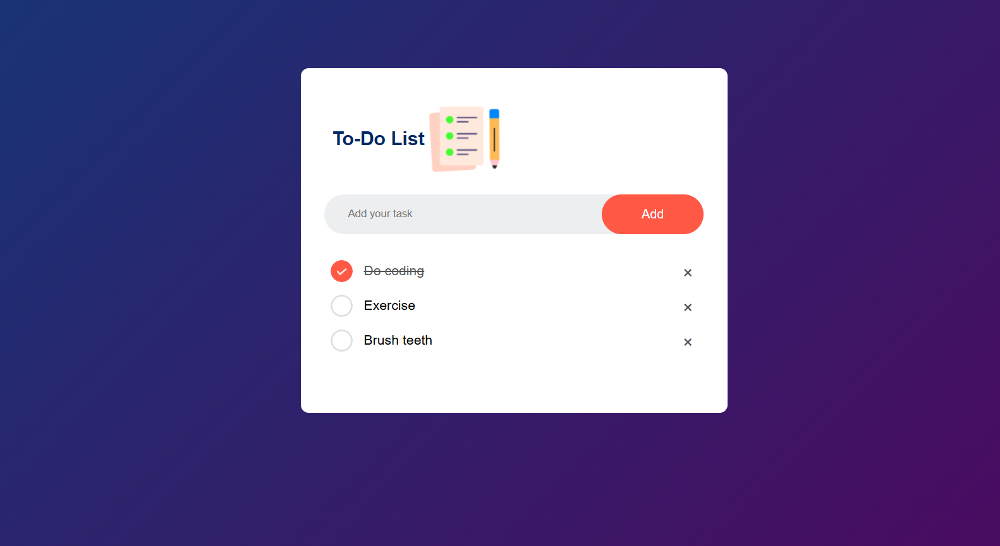

# 📝 To-Do List App

A simple and elegant To-Do List application built using **HTML**, **CSS**, and **JavaScript**.  
This app allows users to add, complete, and delete tasks. Tasks are saved in **localStorage**, so they persist even after the browser is closed.

---

## ✨ Features

- ✅ Add tasks
- ✅ Mark tasks as completed
- ✅ Delete tasks
- ✅ Data persistence with `localStorage`
- ✅ Responsive and clean UI
- ✅ Fully functional with no frameworks

---
## 📸 Preview



---

## 🛠️ Tech Stack

- HTML5
- CSS3 (Flexbox)
- JavaScript (DOM Manipulation, Events, localStorage)

---

## 🚀 Getting Started

### 1. Clone the repository
```bash
git clone https://github.com/JenithX05/To-Do-List.git

-----
2. Open the app in your browser  
Navigate to the project folder and double-click the `index.html` file.  
It will open in your default web browser and launch the To-Do List app instantly.  
No setup or installation is needed.
